# ToMi: Theory of Mind 🧠

<p align="center">
  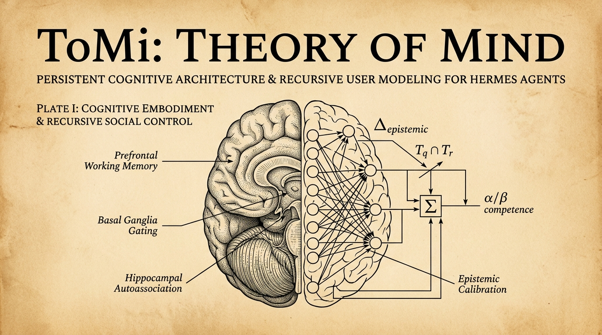
</p>

<p align="center">
  <b>Neuro-Cognitive Architecture & Sovereign Memory Operating System for Hermes Agent</b>
</p>

<p align="center">
  <a href="#-table-of-contents">Table of Contents</a> •
  <a href="#-executive-summary--foundational-vision">Vision</a> •
  <a href="#-theory-of-mind--social-pragmatics-the-core-differentiator">Theory of Mind</a> •
  <a href="#-neuroanatomical-mapping--cognitive-subsystems">Neuroanatomy</a> •
  <a href="#-the-multi-tier-cognitive-memory-hierarchy">Memory Hierarchy</a> •
  <a href="#-quickstart--installation">Quickstart</a> •
  <a href="#-documentation-directory--upstream-credits">Documentation</a> •
  <a href="#-cognition-arena-the-completed-corpus-walk">Cognition Arena</a>
</p>

---

> **ToMi (Theory of Mind)** equips [Nous Research's Hermes Agent](https://github.com/NousResearch/hermes-agent) with a biologically inspired, sovereign cognitive architecture and memory operating system.
>
> Moving beyond stateless next-token prediction and flat vector memory, ToMi provides Hermes with recursive mental modeling (Theory of Mind), multi-tier temperature-regulated memory, an empirical competence ledger, prospective intention triggers, defeasible belief revision, and striatal action gating.
>
> Memory storage is anchored in **PostgreSQL + pgvector and SQLite** operating over local Markdown files. The user's files remain durable and canonical; all semantic embeddings, knowledge graphs, and relational indexes are completely rebuildable.

---

## 🛠️ Operating this repo

> This README is the **vision**. The documents below are the **operator's
> guide** — what to read if you are installing, upgrading, or changing
> anything, rather than deciding whether you want it.

| I want to... | Read |
| :--- | :--- |
| **Work on this repo as an agent — scratchpad, where things go, live data paths** | [`AGENTS.md`](AGENTS.md) |
| Install from scratch | [`INSTALL.md`](INSTALL.md) |
| Configure files, databases, the dashboard | [`SETUP.md`](SETUP.md) |
| **Understand the wiki schema gates — and why one is meant to FAIL** | [`docs/WIKI-QUALITY-GATES.md`](docs/WIKI-QUALITY-GATES.md) |
| **Know what is done and what is NOT** | [`docs/WIKI-GOLD-STANDARD-STATE.md`](docs/WIKI-GOLD-STANDARD-STATE.md) |
| **Prove a brain subsystem earns its cost** | [`docs/audit/ablation-cortex-pilot.md`](docs/audit/ablation-cortex-pilot.md) |
| Debug the web stack | [`TROUBLESHOOTING.md`](TROUBLESHOOTING.md) |
| Know what is deliberately not in git, and why | [`archive/README.md`](archive/README.md) |

**If you show someone this repo and they run only `INSTALL.md`, they will
get a working install** — including the two embedding environment
variables, the 2048-token window, and the 2000-vs-2560 dimension
explanation. **They will not** get the schema gates, because those are
maintenance surface, not install surface. That is deliberate, and the
pointer above is here so nobody has to guess.

---

<p align="center">
  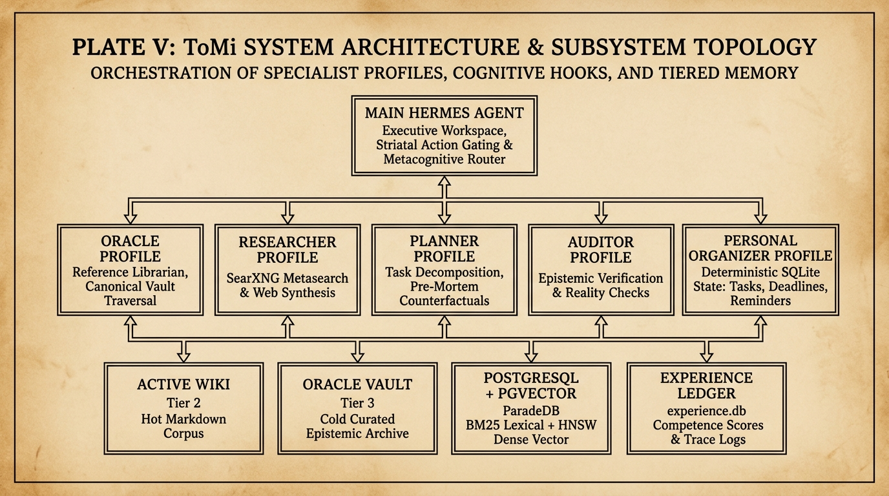
</p>

---

## 📑 Table of Contents

1. [Executive Summary & Foundational Vision](#-executive-summary--foundational-vision)
2. [Theory of Mind & Social Pragmatics: The Core Differentiator](#-theory-of-mind--social-pragmatics-the-core-differentiator)
3. [Technology Stack & Upstream Integrations](#-technology-stack--upstream-integrations)
4. [Neuroanatomical Mapping & Cognitive Subsystems](#-neuroanatomical-mapping--cognitive-subsystems)
5. [The Multi-Tier Cognitive Memory Hierarchy](#-the-multi-tier-cognitive-memory-hierarchy)
   - [The Problem With Flat Memory](#the-problem-with-flat-memory)
   - [Context Capacity vs. Focused Attention](#context-capacity-vs-focused-attention)
   - [Tier 1: Hot Knowledge & Prefrontal Working Memory](#tier-1-hot-knowledge--prefrontal-working-memory)
   - [Tier 2: Warm Relational & Autobiographical Memory](#tier-2-warm-relational--autobiographical-memory)
   - [Tier 3: Cold Curated Knowledge & Lossless Archiving](#tier-3-cold-curated-knowledge--lossless-archiving)
   - [Rebuildable Search Infrastructure: Dense & Hybrid Search](#rebuildable-search-infrastructure-dense--hybrid-search)
   - [Derived Knowledge Graph & Multi-Hop Traversal](#derived-knowledge-graph--multi-hop-traversal)
6. [Deterministic State & Prospective Memory Engine](#-deterministic-state--prospective-memory-engine)
   - [Personal Organizer vs Hermes Kanban](#personal-organizer-vs-hermes-kanban)
   - [Prospective Memory: Remembering Future Intentions](#prospective-memory-remembering-future-intentions)
   - [Multi-Channel Timed Reminders](#multi-channel-timed-reminders)
7. [Epistemic Control & Defeasible Belief Revision](#-epistemic-control--defeasible-belief-revision)
   - [Evidence Is Not Belief](#evidence-is-not-belief)
   - [Belief Lifecycle & Provenance Hierarchy](#belief-lifecycle--provenance-hierarchy)
   - [Pollock Defeater Calculus & AGM Minimal Mutilation](#pollock-defeater-calculus--agm-minimal-mutilation)
   - [Dual-Process Supersession Chains](#dual-process-supersession-chains)
8. [Executive Planning, Action Gating & Metacognitive Routing](#-executive-planning-action-gating--metacognitive-routing)
   - [Specialist Profiles & Context Isolation](#specialist-profiles--context-isolation)
   - [Planner World-Model & Pre-Mortem Reasoning](#planner-world-model--pre-mortem-reasoning)
   - [Striatal Inhibitory Action Gate](#striatal-inhibitory-action-gate)
   - [Consequence-Gated Execution & Value of Information](#consequence-gated-execution--value-of-information)
   - [Dual-Process Cognitive Routing (System 1 vs System 2)](#dual-process-cognitive-routing-system-1-vs-system-2)
9. [Experience Index & Adaptive Competence Loop](#-experience-index--adaptive-competence-loop)
   - [Reality Gets the Final Vote](#reality-gets-the-final-vote)
   - [The 7-Table Competence Ledger (`experience.db`)](#the-7-table-competence-ledger-experiencedb)
   - [Evidence-Gated Reflection](#evidence-gated-reflection)
   - [Procedural Learning: Native Skill Evolution](#procedural-learning-native-skill-evolution)
10. [Autonomous Daemons & Cron Lifecycle](#-autonomous-daemons--cron-lifecycle)
11. [Neuro-Cognitive Python Core (`brain/`)](#-neuro-cognitive-python-core-brain)
    - [Python API Usage](#python-api-usage)
12. [Command Deck Dashboard & Spatial Interfaces](#-command-deck-dashboard--spatial-interfaces)
    - [Executive Operations HUD](#executive-operations-hud)
    - [Upstream Companion Applications (`ai-visualizer` & `barehands`)](#upstream-companion-applications-ai-visualizer--barehands)
    - [Service Port Matrix](#service-port-matrix)
    - [Self-Hosted VM Deployment Topology](#self-hosted-vm-deployment-topology)
13. [Canonical Division of Authority (Sources of Truth)](#-canonical-division-of-authority-sources-of-truth)
14. [Architectural Principles & Boundaries (What We Do NOT Build)](#-architectural-principles--boundaries-what-we-do-not-build)
15. [Quickstart & Installation](#-quickstart--installation)
16. [Documentation Directory & Upstream Credits](#-documentation-directory--upstream-credits)
17. [Cognition Arena: The Completed Corpus Walk](#-cognition-arena-the-completed-corpus-walk)
18. [References & Evidence Base](#-references--evidence-base)

---

## 🔭 Executive Summary & Foundational Vision

Large language models are inherently stateless next-token predictors. Left without cognitive scaffolding, persistent autonomous agents inevitably decay into predictable failure modes: unbounded context stuffing, flat vector databases polluting working attention with out-of-context chunks, hallucinations masquerading as historical facts, and runaway retry loops when external actions fail.

**ToMi (Theory of Mind)** establishes a sovereign, self-hosted neuro-cognitive operating system for Hermes Agent. It unifies two complementary foundations into a single architectural runtime:

1. **Theory of Mind & Metacognitive Control**: Recursive human mental modeling, intent and goal-drift tracking, conversational pragmatics, epistemic provenance verification, consequence-gated action inhibition, and empirical competence tracking.
2. **Biologically Grounded Neuro-Cognitive Subsystems**: Sensory gating, working memory chunking, somatic visceral risk biasing, basal ganglia action selection (Go / No-Go / Emergency Brake), associative graph recall, counterfactual simulation rollouts, and offline consolidation replay.

<p align="center">
  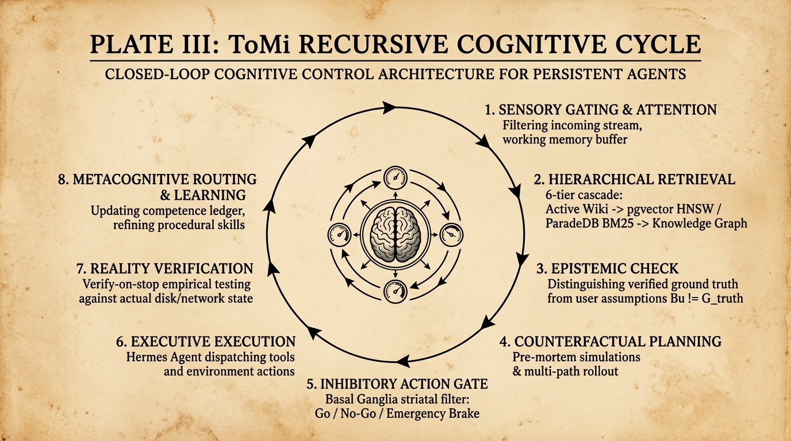
</p>

### The Core Design Principle

> **Knowledge changes temperature. It does not automatically disappear.**

Storage is cheap; focused attention is scarce and expensive. ToMi never attempts to manage long-horizon growth by blindly truncating conversation history or executing destructive summarizations that erase empirical evidence. Instead, it continuously regulates **how far information sits from the active model's working context**, preserving the raw evidence that made the agent capable while keeping immediate attention razor-sharp.

---

## 🧠 Theory of Mind & Social Pragmatics: The Core Differentiator

Most persistent agents fail because they treat human communication as flat strings of text rather than intentional acts from an agent with beliefs, desires, and changing goals. 

ToMi implements explicit **Theory of Mind (ToM)** modeling (`brain/social/tom.py`) and **Conversational Pragmatics** (`brain/social/pragmatics.py`):

<p align="center">
  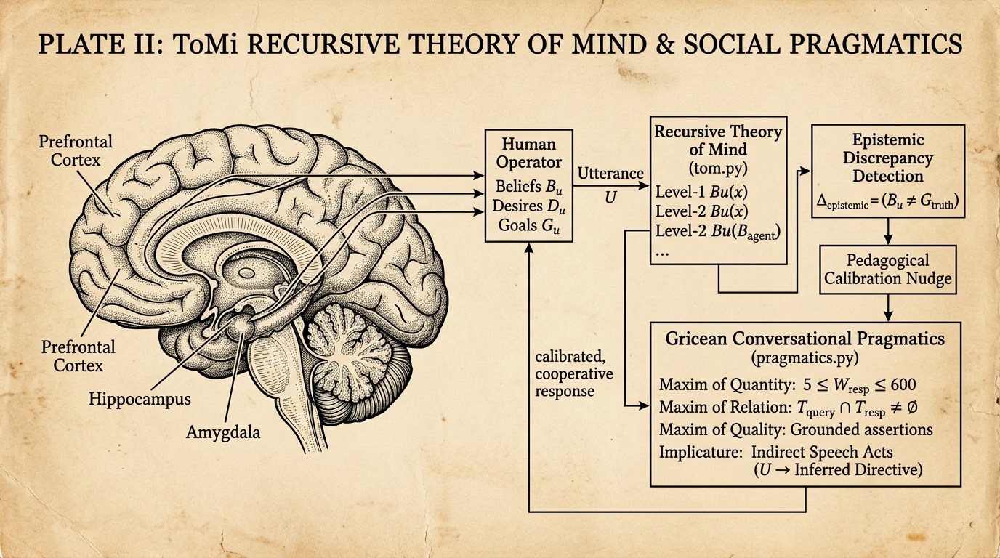
</p>

By actively tracking what the operator believes, what they expect, and where their assumptions conflict with verified ground truth, ToMi enables Hermes to collaborate as an empathetic, context-aware peer rather than a reactive parrot.

---

## 🧩 Technology Stack & Upstream Integrations

ToMi is engineered as an integration and orchestration ecosystem. Rather than reinventing proven wheels, it connects high-performance open-source tools with non-invasive bridges:

| Project | Role in Architecture | Purpose & Implementation |
| :--- | :--- | :--- |
| **[Hermes Agent](https://github.com/NousResearch/hermes-agent)** (Nous Research) | **Core Agent Engine** | Primary execution runtime. Extended via 5 lifecycle hooks (`hooks/`), 58 installable skills across 73 cognitive categories (`skills/`), plugins (`plugins/`), and 15 specialized agent profiles (`profiles/`). |
| **[Honcho](https://github.com/plastic-labs/honcho)** (Plastic Labs) | **Autobiographical Memory** (`:8000`) | User-modeling dialectic engine that tracks communication style, personal preferences, and implicit assumptions across sessions. Runs as an isolated companion service, backed by PostgreSQL + pgvector.<sup>[35](REFERENCES.md#ref-35)</sup> |
| **PostgreSQL 18.6 + pgvector** | **Dense Knowledge Search** (`:5433`) | Scalable vector database with native HNSW indexing,<sup>[39](REFERENCES.md#ref-39)</sup> running on the ParadeDB image.<sup>[37](REFERENCES.md#ref-37)</sup> Combines lexical ranking with dense cosine embeddings via Reciprocal Rank Fusion (RRF). |
| **[ParadeDB `pg_search`](https://github.com/paradedb/paradedb)** (AGPL-3.0) | **True BM25 Lexical Scoring** (live) | Native Postgres index access method providing genuine BM25 — term-frequency saturation and document-length normalisation — transactionally consistent with the table, so there is no separate index to fall stale. Ships in the same image as pgvector; its own vector path is beta and is deliberately not used. **Both indexes are built and verified**: a BM25 query for `memory` returns 1106 hits, and HNSW returns nearest neighbours. See [`RETRIEVAL-SETUP-HANDOFF.md`](RETRIEVAL-SETUP-HANDOFF.md).<sup>[33](REFERENCES.md#ref-33)</sup> |
| **[Graphify](https://github.com/Graphify-Labs/graphify)** | **Knowledge Graph Extraction** | LLM-extracted concept/relation graphs over the Markdown corpora (Active Wiki and Oracle Vault, indexed independently). Rebuildable index, never canonical; deterministic `[[wikilink]]` edges are protected as the authoritative skeleton.<sup>[34](REFERENCES.md#ref-34)</sup> |
| **[SearXNG](https://github.com/searxng/searxng)** | **Private Metasearch** (`:8080`) | Privacy-respecting, self-hosted metasearch aggregator combining 70+ search engines with zero API tracking. Queried exclusively by the `researcher` profile. |
| **[Firecrawl](https://github.com/mendableai/firecrawl)** | **Web Scraping & Extraction** | Structured web extraction with headless browser automation, bypassing anti-bot walls and returning clean Markdown for deep research sweeps. |
| **[AI Visualizer](https://github.com/jaredrhod/ai-visualizer)** (Jared Rhodes) | **Procedural Reactive Avatar** (`:8790`) | Zero-dependency HTML5 canvas avatars (Neural Core, Matrix Rain, Starburst) connected via non-invasive lifecycle hooks to reflect thinking, speaking, and idle states. |
| **[Barehands](https://github.com/jaredrhod/barehands)** (Jared Rhodes) | **3D Spatial Holographic Stage** (`:8794`) | Webcam hand-tracking spatial interface built with MediaPipe and Three.js for mid-air manipulation of architecture cards and mind maps. |
| **FastAPI & Uvicorn** | **Command Deck Backend** (`:8088`) | Asynchronous, low-latency Python backend powering the unified Command Deck API, real-time cognitive telemetry endpoints, task management, and copilot chat. |
| **SQLite 3** | **Deterministic State Store** | In-process, acid-compliant transactional database backing the Personal Organizer (`organizer.db`: tasks, deadlines, reminders, intentions) and competence ledger (`experience.db` / `state.db`). |

---

## 🗺️ Neuroanatomical Mapping & Cognitive Subsystems

ToMi models its functional architecture after biological neuroanatomy. Each subsystem emulates a specific cognitive specialty:

| Brain Region | Function Emulated | Subsystem & File Path | Concrete Mechanism & Theoretical Grounding |
| :--- | :--- | :--- | :--- |
| **Thalamus** | Sensory relay & saliency gating | `brain/thalamus/attention.py`, `buffer.py`, `adaptive_threshold.py` | Ring buffer; Shannon entropy novelty scoring + keyword boost + learned adaptive thresholding based on surprise history. |
| **Hippocampus (DG)** | Pattern separation | `brain/hippocampus/pattern_separation.py`, `replay.py` | Geometric pattern separation via orthonormal random projection and top-$k$ sparsity threshold. |
| **Hippocampus (CA3)** | Autoassociative completion | `brain/hippocampus/associative.py` | Attractor dynamics restoring complete episodic memories from partial, noisy retrieval cues. |
| **Hippocampus (CA1)** | Readout & associative recall | `brain/hippocampus/associative.py` | Personalized PageRank (PPR) traversal over bipartite concept-episode knowledge graphs. |
| **Hippocampus (SWR)** | Offline replay & consolidation | `brain/hippocampus/replay.py` | Sharp-Wave Ripple (SWR) prioritized replay during sleep/idle consolidation over high-surprise episodes. |
| **Prefrontal Cortex (dlPFC)** | Working memory attention | `brain/cortex/dl_pfc.py` | Cowan/Miller $4 \pm 1$ limited-capacity active attention slots with turn-based decay and goal hierarchy tracking. |
| **Executive Control** | Miyake control triad | `brain/cortex/executive.py`, `confidence.py` | Response inhibition, working memory updating, and cognitive set-shifting to eliminate runaway loops. |
| **Basal Ganglia** | Striatal action selection | `brain/basal_ganglia/action_gate.py` | Direct (Go), Indirect (No-Go), and Hyperdirect (Emergency Brake) action gating before shell/tool execution. |
| **Striatum (Dorsolateral)** | Habit formation & compilation | `brain/basal_ganglia/compiler.py` | Procedural habit compiler turning repeated episodic successes into native, governed Hermes Skills. |
| **Limbic (Amygdala)** | Affective evaluation & fear conditioning | `brain/limbic/amygdala.py`, `somatic.py`, `valence.py` | Three pathways (direct subcortical fear conditioning, cortical appraisal, active prefrontal extinction) + Damasio Somatic Marker Hypothesis visceral risk biasing. |
| **Insula** | Interoceptive state monitoring | `brain/limbic/valence.py` | Allostatic load tracking: monitors cumulative cognitive fatigue, repeated failure strain, and rate-limiting stress. |
| **Default Mode Network** | Mental time travel & counterfactuals | `brain/dmn/chronesthesia.py`, `counterfactual.py` | Tulving chronesthesia (retrospection/prospection) + Judea Pearl causal counterfactual regret rollouts. |
| **Temporoparietal Junction** | Theory of Mind & Pragmatics | `brain/social/tom.py`, `pragmatics.py` | Recursive L1/L2 modeling of human beliefs, user goal drift detection, and Gricean conversational maxims. |
| **Epistemology & Belief** | Defeasible logic & AGM revision | `brain/epistemology/agm.py`, `defeater_graph.py`, `dialectic.py` | AGM postulates via Levi Identity (support-edge closure, remainders, entrenchment partial order) + Pollock defeater calculus. |
| **Prospective Memory** | Standing intentions & triggers | `brain/prospective/intentions.py` | Gollwitzer implementation intentions (`IF cue THEN action`) with deterministic keyword/substring triggers, mandatory expiry, and demotion. |
| **Global Workspace** | Conscious broadcast & arbitration | `brain/cortex/router.py`, `wiring.py` | Dynamic System 1 (reflexive heuristic) vs System 2 (deliberative tree-of-thought) compute allocator. |

**An important caveat on this mapping, and it is a warning about how these systems get evaluated.** A controlled ablation of a comparable 15-subsystem memory architecture found that under moderate load **14 of the 15 subsystems appeared to contribute nothing** — every one could be removed at no measurable cost. Only when load was raised did the picture change: 9 of 15 became individually critical, and five subsystems moved from *exactly* 0% effect to below −89%. The authors name this **cooperative masking**.<sup>[31](REFERENCES.md#ref-31)</sup> Two operational rules follow, and this repo follows both:

1. **A subsystem you cannot detect working is not thereby dead.** Absence of measured effect at one load is not evidence of absence of function. Never prune a subsystem on the basis of a single low-load ablation.
2. **Test ablations at the load where the system is actually used.** Probe at the operating point, or you will systematically conclude that everything is decorative.

The mapping is a design vocabulary, not a claim of biological fidelity — and note that the SWR replay subsystem is more accurately described as *idle* consolidation than as a night-only process, for the reasons given under [Dual-Process Supersession Chains](#dual-process-supersession-chains).<sup>[4](REFERENCES.md#ref-4)</sup> <sup>[5](REFERENCES.md#ref-5)</sup> <sup>[6](REFERENCES.md#ref-6)</sup>

---

## 🏛️ The Multi-Tier Cognitive Memory Hierarchy

### The Problem With Flat Memory

Persistent autonomous agents must answer fundamentally different questions across distinct temporal horizons, certainty levels, and operational contexts:

<p align="center">
  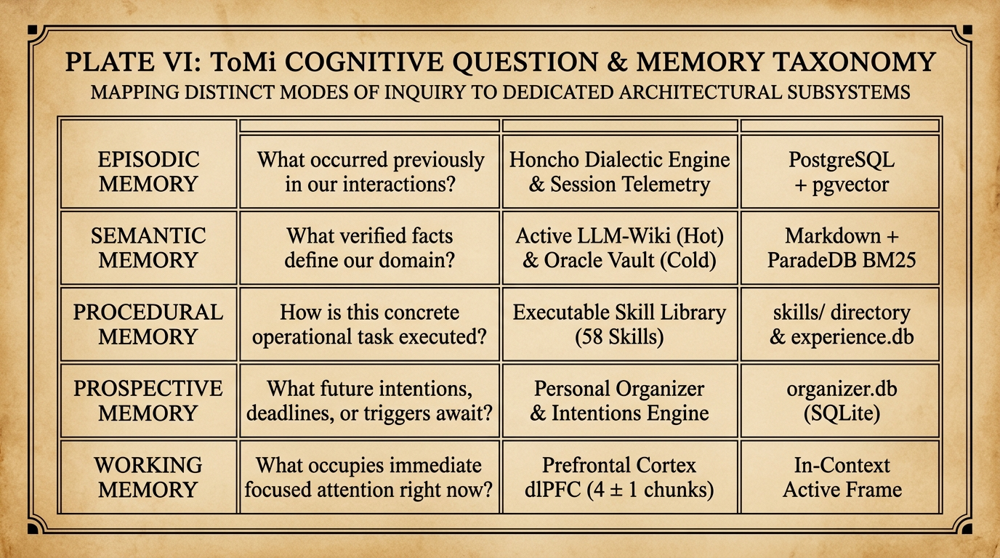
</p>

These cannot be answered by a single database or flat vector store. ToMi gives each class of cognitive inquiry a dedicated, authoritative home.

The flat-memory failure is not hypothetical. Under sustained agent operation, consolidated memory that is repeatedly summarised and re-ingested first improves, then degrades, and can eventually fall *below* a no-memory baseline; one frontier model, tasked with solving problems it had already solved, failed 54% of them from its own faulty memory.<sup>[9](REFERENCES.md#ref-9)</sup> The corollary is that agents should retain raw episodes rather than forced-consolidated summaries — such agents showed double the accuracy of their consolidating counterparts.<sup>[9](REFERENCES.md#ref-9)</sup> Storage alone is also not sufficient: one system reached 93.0% on LoCoMo with no graph store, no vector index and no GPU, which is the null result that disciplines any claim that a graph is *necessary*.<sup>[24](REFERENCES.md#ref-24)</sup>

<p align="center">
  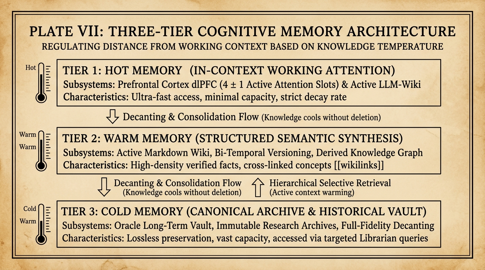
</p>

<p align="center">
  
</p>

---

### Context Capacity vs. Focused Attention

Massive context windows do not solve memory. A model can technically fit an entire corpus and still suffer catastrophic attention degradation when critical facts are drowned out by irrelevant noise:

<p align="center">
  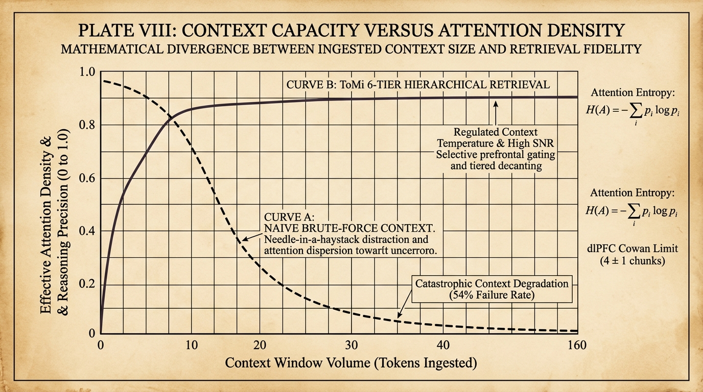
</p>

ToMi enforces a **6-Level Hierarchical Retrieval Cascade** to preserve razor-sharp context:

<p align="center">
  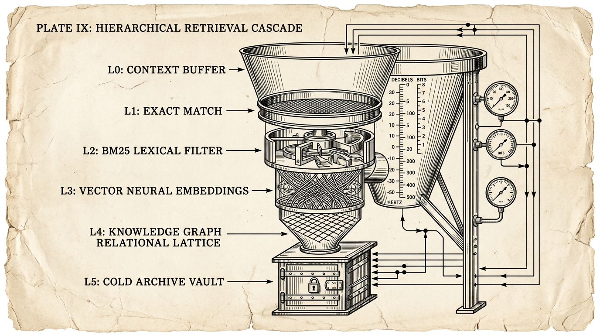
</p>

---

### Tier 1: Hot Knowledge & Prefrontal Working Memory

- **Prefrontal Cortex (dlPFC)** (`brain/cortex/dl_pfc.py`): Manages limited-capacity active attention slots (Cowan/Miller $4 \pm 1$ chunks), active goal hierarchies, hypothesis tracking, and activation decay across conversation turns.
- **Active LLM-Wiki**: Current semantic knowledge lives in Hermes's implementation of Andrej Karpathy's [LLM-Wiki pattern](https://gist.github.com/karpathy/442a6bf555914893e9891c11519de94f). Contains active project documentation, recent research conclusions, and immediate technical decisions. User-supplied knowledge enters Active Wiki immediately.

---

### Tier 2: Warm Relational & Autobiographical Memory

- **Honcho** (`http://127.0.0.1:8000`): Plastic Labs' autobiographical memory engine. Builds a persistent dialectic model of the user: communication style, preferences, recurring goals, and evolving assumptions.
- **Associative Graph** (`brain/hippocampus/associative.py`): Concept-episode graph traversed via Personalized PageRank (PPR), allowing lookups to follow associative hops rather than relying solely on cosine vector proximity.

---

### Tier 3: Cold Curated Knowledge & Lossless Archiving

- **Oracle Profile & Curated Vault**: Dedicated long-term historical librarian profile. Searches a massive historical corpus and returns a compact, context-compressed synthesis to Main Hermes:

<p align="center">
  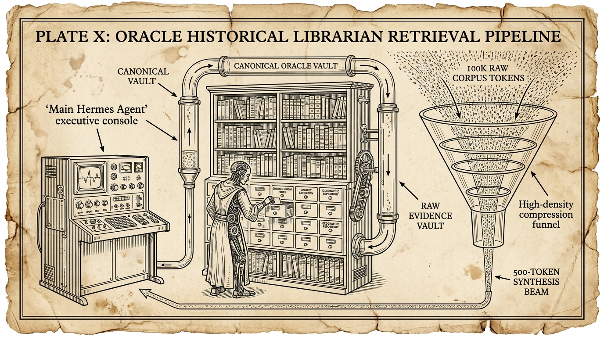
</p>

- **Additive Multi-Resolution Synthesis**: ToMi never performs destructive summarization. Summaries are added alongside preserved raw evidence:

<p align="center">
  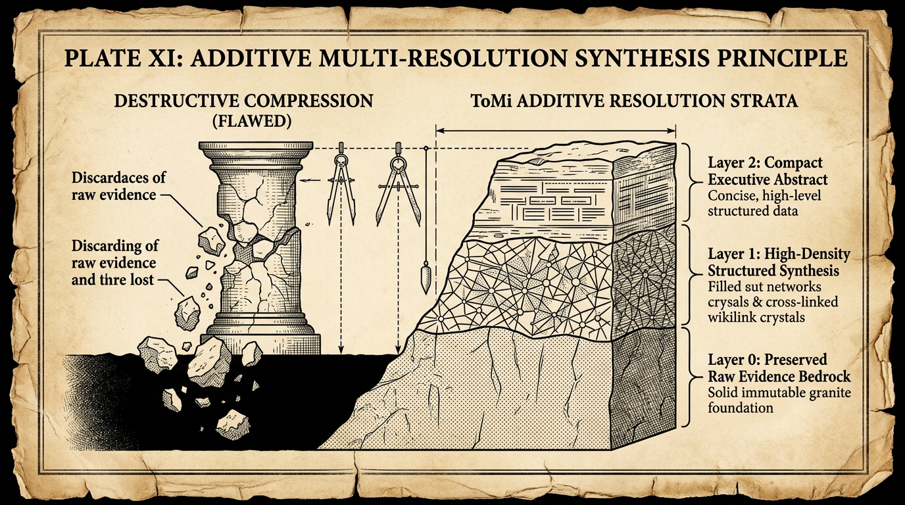
</p>

- **Knowledge Lifecycle & Decanting**: Active knowledge is decanted to the cold curated Oracle vault only after raw evidence preservation, checksum verification, and search indexing pass:

<p align="center">
  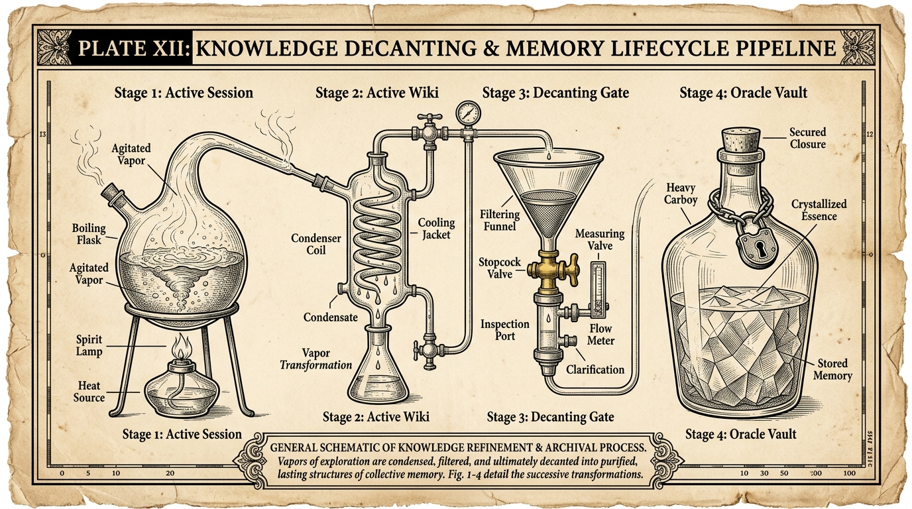
</p>

- **Historical Knowledge Reactivation**: When historical knowledge is needed again, it is referenced into working context without mutating the immutable archival record:

<p align="center">
  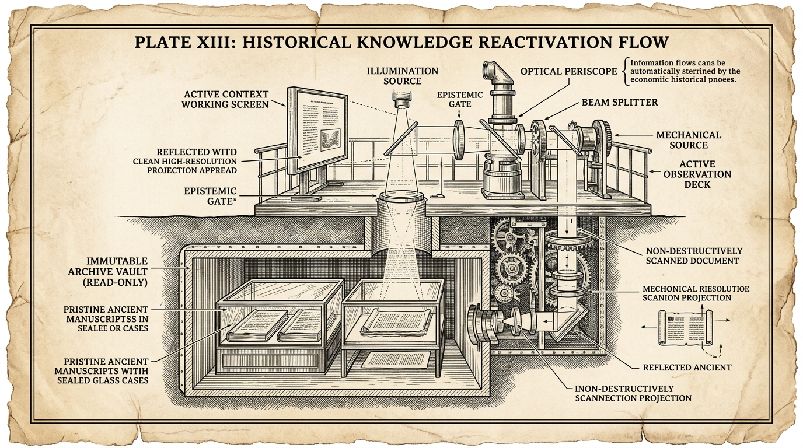
</p>

---

### Rebuildable Search Infrastructure: Dense & Hybrid Search

Knowledge base search is powered by **PostgreSQL 18.6 + pgvector + pg_search**:
- **Semantic / Vector Search**: Cosine similarity via pgvector's HNSW index.<sup>[39](REFERENCES.md#ref-39)</sup> Embeddings come from `Qwen3-Embedding-4B-Q8_0.gguf` served by llama.cpp (`--embedding --pooling last`).<sup>[36](REFERENCES.md#ref-36)</sup> The model returns **2560** dimensions and the column is **2000**; the server ignores a `dimensions` parameter, so `brain_sync.py` truncates client-side — the truncation is ours, not the model's.<sup>[38](REFERENCES.md#ref-38)</sup>
- **Lexical Search**: True BM25 via ParadeDB's `pg_search`, queried with `content @@ plainto_tsquery(...)`.<sup>[33](REFERENCES.md#ref-33)</sup> **This is live, not planned** — the index is built and verified (a query for `memory` returns 1106 hits). Three independent sources find tuned BM25 the single highest-value memory investment available.<sup>[12](REFERENCES.md#ref-12)</sup> <sup>[14](REFERENCES.md#ref-14)</sup> <sup>[25](REFERENCES.md#ref-25)</sup>
- **Hybrid Fusion**: Reciprocal Rank Fusion (RRF, `rrf_k = 60.0`) combining vector and keyword hits. 60 is the conventional RRF constant and the value ParadeDB's own hybrid-search documentation uses,<sup>[33](REFERENCES.md#ref-33)</sup> so the two scorers can be fused by the same function unchanged.
- **Retrieve-Then-Read, In Document Order**: Chunks are returned in source order rather than reranked. Under matched token budgets, a simple retrieve-then-read that preserves document order consistently matches or beats substantially more elaborate pipelines,<sup>[13](REFERENCES.md#ref-13)</sup> which is the design this repo follows deliberately.
- **Durable vs. Rebuildable Philosophy**: The user's Markdown corpus is canonical and durable. The database, embeddings, chunks, and graph relationships are completely disposable and rebuildable:

<p align="center">
  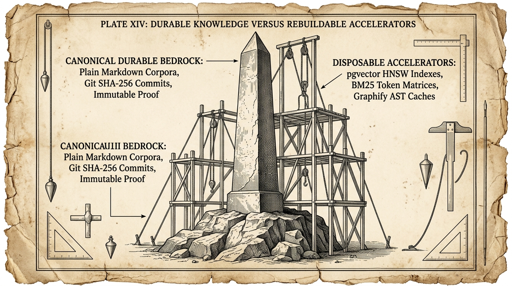
</p>

---

### Derived Knowledge Graph & Multi-Hop Traversal

Similarity search answers *"what is similar to this text?"*. It cannot answer *"what connects these two concepts?"*, which requires traversing relationships. ToMi provides a derived knowledge graph for multi-hop navigation:

<p align="center">
  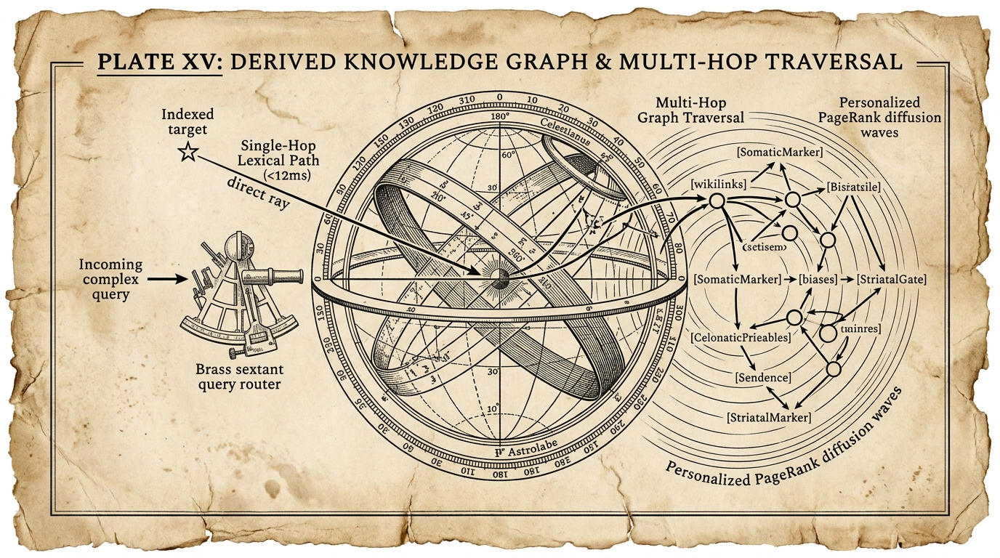
</p>

- **Two Separate Graphs**: Active Wiki and Oracle Vault are indexed independently, preventing active working state from being polluted with historical archives.
- **Derived, Not Canonical**: The graph is a rebuildable index. The Markdown files are the source of truth.
- **Queryable with Provenance**: Traversal returns the exact path connecting related concepts, providing full explanatory provenance.
- **As A View Alongside RAG, Never As A Replacement**: This is a settled design decision and is recorded here so it is not relitigated. The graph's value is bounded, and the bounds are measurable. Graph grounding helps only when the decisive fact lies *outside* the model's training distribution;<sup>[23](REFERENCES.md#ref-23)</sup> and only pays off where multi-hop composition is genuinely required.<sup>[15](REFERENCES.md#ref-15)</sup> Against that, plain RAG matches GraphRAG on simple fact retrieval, and a 28-tier scaling study finds tuned BM25 leading by ~20 points at full corpus scale while plain RAG's complex-reasoning recall collapses 58.64% → 43.20% as the corpus grows.<sup>[11](REFERENCES.md#ref-11)</sup> <sup>[12](REFERENCES.md#ref-12)</sup> At this project's 14,589-file scale the graph earns its place — but as one arm of a hybrid, not as the system of record.
- **The Graph's Real Job Is Supersession, Not Traversal**: Ordinary relevance recall is where a vector baseline is already "largely equivalent" to a hand-modelled graph.<sup>[20](REFERENCES.md#ref-20)</sup> The measured gap is concentrated in supersession and set-completeness queries, where a graph with explicit version links scores 0.98–1.00 against a vector baseline's 6–27%.<sup>[20](REFERENCES.md#ref-20)</sup> Revision-chain recall reaches 100% when evidential status is modelled explicitly, versus 25% for systems that re-read raw history at query time.<sup>[19](REFERENCES.md#ref-19)</sup> And the failure mode is sharp: cosine similarity distinguishes a *contradicted* fact from a *duplicated* one at AUROC 0.59 — near chance — so RAG serves superseded values 15–40% of the time.<sup>[18](REFERENCES.md#ref-18)</sup> The design consequence is that lifecycle must be a **deterministic, indexed, query-time filter**, never an inference over vector similarity.
- **Amplification Risk, Quantified**: Because the graph is LLM-extracted, a single bad extraction becomes a *structurally supported* wrong path rather than one wrong answer. Corrupting under 0.05% of the corpus text collapses QA accuracy from 95% to 50%, and state-of-the-art defences fail to detect it.<sup>[22](REFERENCES.md#ref-22)</sup> This is the direct reason the deterministic `[[wikilink]]` edges are protected as canonical and the extracted edges are treated as advisory.
- **Retrieval Need Not Be Passive**: For any budget *T* ≥ 2, the behaviour set reachable by passive retrieval is a strict subset of that reachable by active retrieval at equal cost — no amount of tuning a passive retriever closes it.<sup>[32](REFERENCES.md#ref-32)</sup> The implemented retriever is a pure-standard-library personalised-PageRank diffusion with provenance paths, so it cannot fail on an absent service.
- **Costs Are Real, and Simplicity Wins**: A Stanford/SJTU profile of ten agent-memory systems found BM25 buildable in under a second and scoring 55.8%, while A-Mem needed ~17,666 seconds of construction to score 42.1%.<sup>[14](REFERENCES.md#ref-14)</sup> A full 2⁵ factorial over agent scaffolding components found that in *every* configuration the best proper subset matches or exceeds the all-in system.<sup>[10](REFERENCES.md#ref-10)</sup> The operative rule for this project: **the graph earns its maintenance cost only where it changes an answer that RAG gets wrong.**
- **The Reference Implementation Is Not Automatically Better**: The best-known published graph-RAG system reaches parity with strong dense retrieval on single-hop lookup and wins on multi-hop, and its own ablations locate that advantage in *graph construction* rather than in the traversal algorithm — seeding the graph from query-matched triples beats seeding it from extracted entities by 12.5 recall points, and removing passage nodes from the graph costs 6.1.<sup>[16](REFERENCES.md#ref-16)</sup> It also reaches its own 22-system benchmark's single-hop number by way of a query-time model call that contributes 0.7 recall points.<sup>[25](REFERENCES.md#ref-25)</sup> This repo implements the traversal in pure standard library over a deterministically-linked corpus and keeps provenance paths, which is a defensible trade: **the graph is the variable worth improving, and the framework is not.**
- **Benchmark Caveat**: The principal published graph-RAG benchmark suite contains no entry for several popular memory frameworks at all,<sup>[27](REFERENCES.md#ref-27)</sup> and the field's evaluations are known to be soft — underscaled benchmarks and ignored system costs are recurring problems in agent-memory measurement.<sup>[26](REFERENCES.md#ref-26)</sup> Judge this subsystem against `cognition-arena/` and `measure_retrieval_quality.py`, not against a leaderboard.

---

## ⚡ Deterministic State & Prospective Memory Engine

### Personal Organizer vs Hermes Kanban

Human life, schedules, and task state must not rely on probabilistic vector recall. ToMi maintains a deterministic SQLite database (`organizer.db`):

<p align="center">
  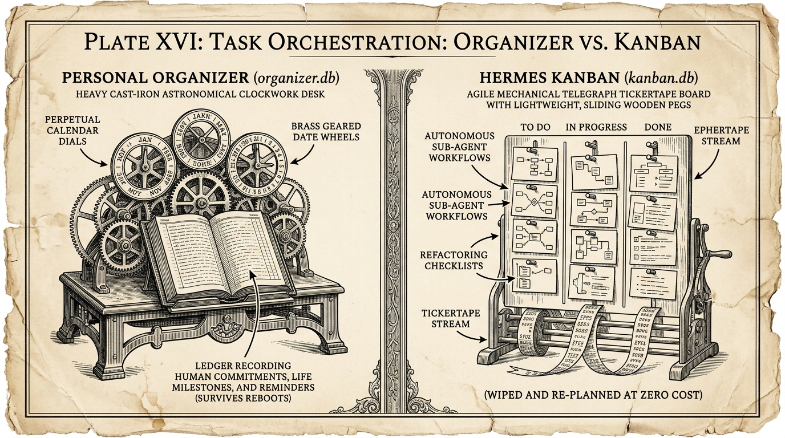
</p>

- **Personal Organizer (`organizer.db`)**: Manages human tasks, projects, deadlines, waiting states, subscription renewals, and scheduled reminders.
- **Hermes Kanban**: Manages internal multi-agent execution subtasks and tool dependencies.

---

### Prospective Memory: Remembering Future Intentions

Humans do not just remember the past; they continuously hold intentions for the future (*"When package arrives, remind me to install it"*, *"The next time we discuss GPU architecture, check memory bandwidth"*):

<p align="center">
  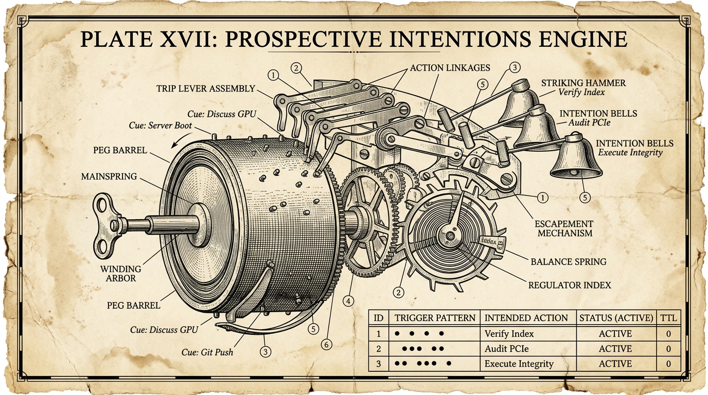
</p>

ToMi represents future intentions explicitly:
```text
IF cue X occurs THEN surface/execute intention Y
```

This is not a stylistic choice but the measured requirement. On a purpose-built prospective-memory benchmark, giving a small model an explicit typed intention store moved it from **4.2% to 66.2%** Set-F1 — beating every retrospective-memory method tested, none of which exceeded 54.4%. The mechanism is the same in both cases: lifecycle rules living in deterministic code rather than inside the model.<sup>[28](REFERENCES.md#ref-28)</sup> The three executive functions this design separates — inhibition, shifting, and updating — are correlated in everyday life but empirically separable,<sup>[29](REFERENCES.md#ref-29)</sup> which is what licenses treating them as distinct subsystems.

These intentions hook into Hermes automation without spinning up redundant schedulers:

<p align="center">
  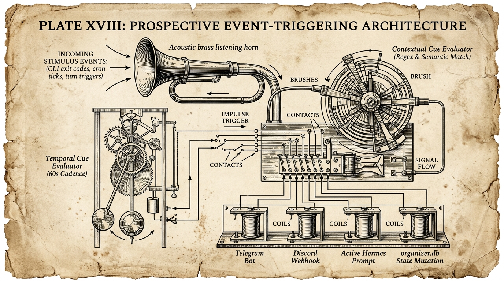
</p>

---

### Multi-Channel Timed Reminders

The Personal Organizer daemon evaluates timed alerts every 60 seconds ($<0.01\%\text{ CPU}$, $<5\text{MB}$ RAM) and dispatches notifications across configured channels:
- **Telegram Bot**
- **Discord Webhook**
- **Slack Bot**
- **Email (SMTP)**
- **Twilio SMS / Phone**
- **Local Desktop Notifications**

---

## ⚖️ Epistemic Control & Defeasible Belief Revision

### Evidence Is Not Belief

A naive memory system retrieves whichever chunk ranks highest and presents it as truth. ToMi interposes an explicit epistemic verification layer:

<p align="center">
  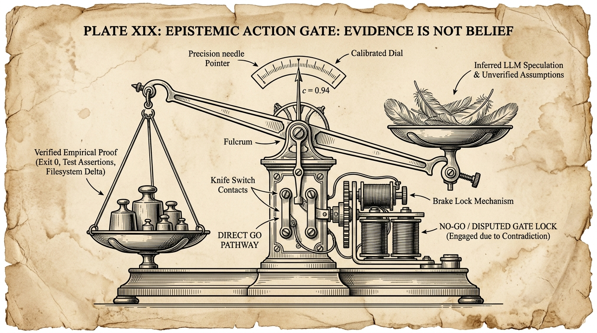
</p>

If Source A states context is 128K and Source B states context is 256K, the system records:
```text
CLAIM:   maximum_context_tokens
STATUS:  DISPUTED
SUPPORT: Source A -> 128K | Source B -> 256K
```
Execution is held until Research or Auditor resolves the discrepancy.

---

### Belief Lifecycle & Provenance Hierarchy

Every belief carries an epistemic provenance class:
1. `user_asserted`: Explicitly provided by the human user.
2. `verified_empirical`: Verified through deterministic tool output, tests, or exit code 0.
3. `inferred_unverified`: LLM deduction or hypothesis.
4. `disputed`: Conflicting evidence detected across sources.
5. `superseded`: Outdated conclusion cleanly replaced by newer verified evidence.

<p align="center">
  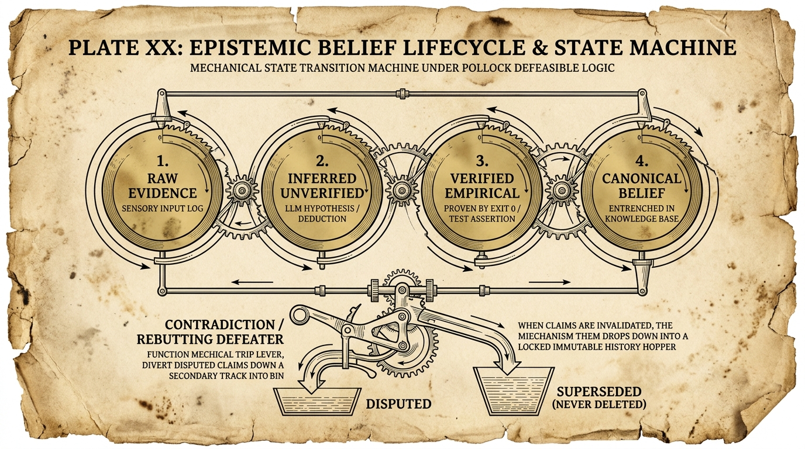
</p>

---

### Pollock Defeater Calculus & AGM Minimal Mutilation

- **John Pollock Defeasible Reasoning (`brain/epistemology/defeater_graph.py`)**: Distinguishes between **rebutting defeaters** (evidence directly contradicting a claim) and **undercutting defeaters** (evidence attacking the reliability of the source or method).
- **AGM Belief Revision (`brain/epistemology/agm.py`)**: Implements the Alchourrón-Gärdenfors-Makinson postulates via the Levi Identity:
  $$K * \phi = (K \div \neg \phi) + \phi$$
  Guarantees **minimal mutilation**—retaining deeply entrenched foundational facts when new evidence requires updating peripheral beliefs.
- **Dialectic Reconciliation (`brain/epistemology/dialectic.py`)**: Thesis-Antithesis-Synthesis pipeline reconciling conflicting propositions into a higher-order grounded model.

---

### Dual-Process Supersession Chains

Drawing from Dual-Process Cognitive Memory (DCPM) research:
- **Daytime System 1 Loop**: Fast incremental belief updates recorded as doubly-linked supersession pointers (`SUPERSEDE`, `UPDATE`, `ADD`). Older assertions are never erased; they become parents in an immutable history chain.
- **Nighttime System 2 Loop**: The offline sleep daemon sweeps accumulated chains, resolves circular contradictions, and induces higher-order schemas.

The offline sweep is precomputation, and the strongest published result for it is narrower than the marketing around it. Precomputing over context before the query arrives yields ~5× less test-time compute at equal accuracy, "up to 13%" and "up to 18%" on stateful reasoning benchmarks, and up to 2.5× lower per-query cost at around ten queries per context — but **the 5× holds at low test-time budgets and reverses at high ones**, and the real agentic coding case yields only ~1.5×.<sup>[1](REFERENCES.md#ref-1)</sup> Amortisation also needs both a high query volume and a corpus that does not change: a correction offered *beside* static precomputed memory is used on only about a third of two-hop questions, and under a tenth once 512 revisions accumulate.<sup>[21](REFERENCES.md#ref-21)</sup>

Two constraints keep this honest. The neuroscience does not privilege sleep itself: one review concludes the critical factor is the engagement of plasticity mechanisms rather than sleep per se,<sup>[4](REFERENCES.md#ref-4)</sup> replay demonstrably occurs during wakefulness as well,<sup>[5](REFERENCES.md#ref-5)</sup> and a meta-analysis found no overall effect of sleep on either accurate *or* false memory consolidation.<sup>[6](REFERENCES.md#ref-6)</sup> The consolidating mechanism is better described as *idle* than as *nocturnal*.<sup>[2](REFERENCES.md#ref-2)</sup> <sup>[3](REFERENCES.md#ref-3)</sup> <sup>[7](REFERENCES.md#ref-7)</sup> Second, replaying an agent's own prior error history into its context measurably *increases* its errors, and the effect does not shrink with scale; RL-trained reasoning models are largely immune, non-reasoning models are not.<sup>[8](REFERENCES.md#ref-8)</sup> **So: prefer exact, cheaply-invalidated precomputation, and never feed raw error trajectories into a model's context wholesale.**

---

## 🚦 Executive Planning, Action Gating & Metacognitive Routing

### Specialist Profiles & Context Isolation

To maintain high attention density, Hermes delegates tasks to isolated profiles:
- **Main Hermes**: Executive workspace; talks to user, determines cognitive route, issues tool calls. **Absolute rule: Main Hermes NEVER searches the web directly.**
- **Researcher Profile**: Dedicated web researcher using local SearXNG (`http://127.0.0.1:8080`), Firecrawl, and CamoFox:

<p align="center">
  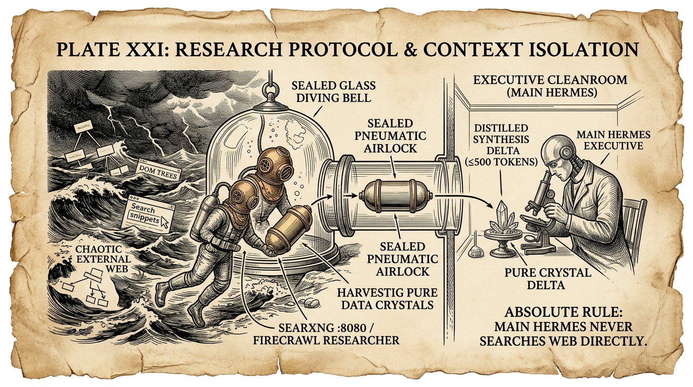
</p>

- **Planner Profile**: Dedicated high-consequence planning and consequence simulation.
- **Oracle Profile**: Historical archive librarian.
- **Auditor Profile**: Epistemic review, conflict resolution, and plan quality verification.

---

### Planner World-Model & Pre-Mortem Reasoning

Complex tasks do not proceed directly from language to action. Planner acts as the practical world-model layer:

<p align="center">
  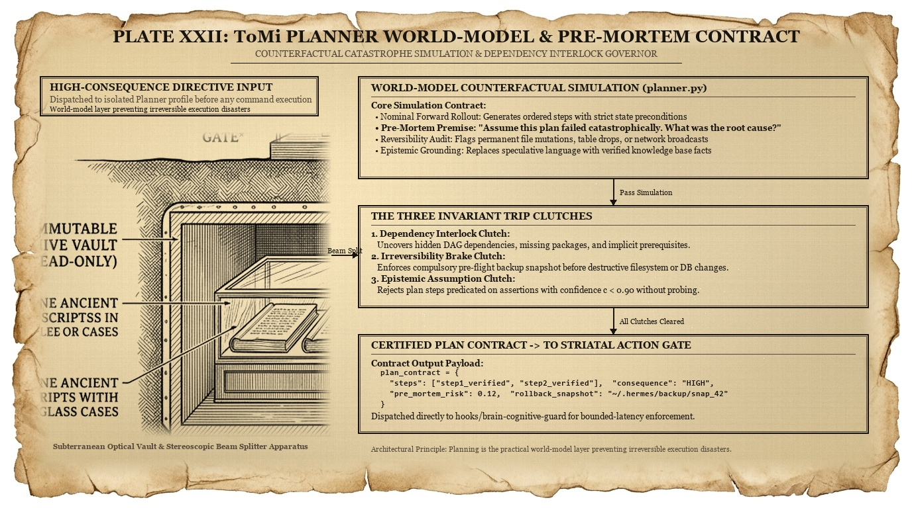
</p>

For high-consequence operations, Planner executes **pre-mortem reasoning**:
> *"Assume this plan failed catastrophically. What was the most probable root cause?"*

This uncovers hidden dependencies, irreversible actions, and unverified assumptions before any command runs.

---

### Striatal Inhibitory Action Gate

Verification after execution is insufficient. ToMi implements basal ganglia action selection (`brain/basal_ganglia/action_gate.py`):
- **Direct Pathway (Go)**: Action authorized; preconditions met, low epistemic risk.
- **Indirect Pathway (No-Go)**: Inhibited; unverified assumptions or disputed facts present.
- **Hyperdirect Pathway (Emergency Brake)**: Instant abort; safety invariants or irreversible deletion detected without backup.

The three-pathway shape is the standard stop-signal-task account of goal-initiated selective action, and its value is specifically the *bounded-latency* No-Go signal: a fast, unconditional brake that does not wait on deliberation.<sup>[30](REFERENCES.md#ref-30)</sup> This is the one place in the architecture where adding model capability actively *reduces* safety, which is why the brake lives in code.<sup>[10](REFERENCES.md#ref-10)</sup>

> **Hermes Hook Contract & Execution Enforcement**: The striatal action gate is enforced via `hooks/brain-cognitive-guard`. In the Hermes Agent runtime, **only `command:*` events** invoke `emit_collect()`, honoring handler return values (`{"decision": "deny" | "handled" | "rewrite", "message": "..."}`). On `command:*`, `NO_GO` and `HYPERDIRECT_BRAKE` return `decision: "deny"`, which **actively halts execution** before the tool or shell command runs. Crucially, `agent:step`, `agent:start`, and `agent:end` all invoke `emit()`, documented in Hermes core as *"Fire all handlers for an event, discarding return values"*. Consequently, the action gate **cannot stop a tool call on `agent:step`** — it logs warning telemetry to `stderr` and records state. Pre-turn stimulus analysis is performed via `hooks/brain-cognitive-prep` on `agent:start`, evaluating risk and caching gate/ToM state in `~/.hermes/cache/brain/cognition/` (via `brain_cognitive_prep.state`, 300s TTL) so post-turn consolidation skips duplicate stimulus ingestion.

<p align="center">
  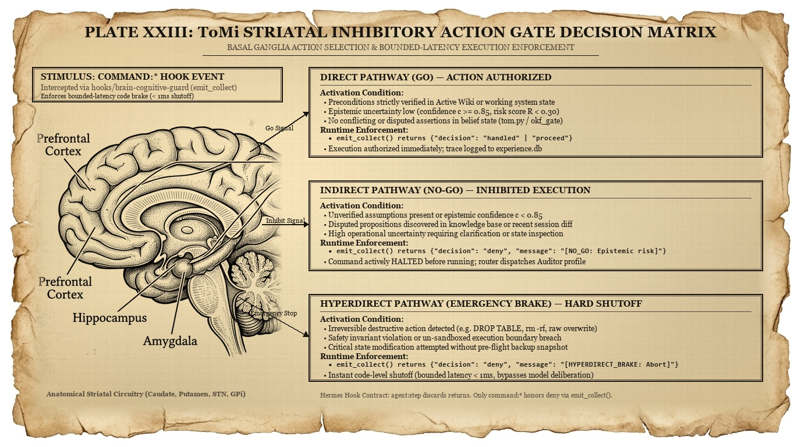
</p>

---

### Consequence-Gated Execution & Value of Information

ToMi prevents both endless clarification questions and reckless assumptions:

<p align="center">
  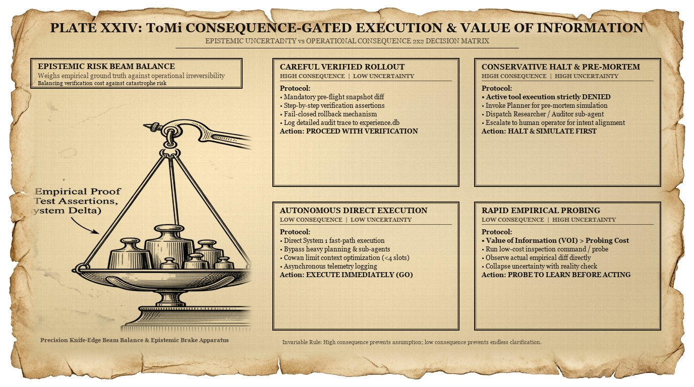
</p>

---

### Dual-Process Cognitive Routing (System 1 vs System 2)

Tasks are classified dynamically based on complexity, epistemic uncertainty, and operational consequence:

<p align="center">
  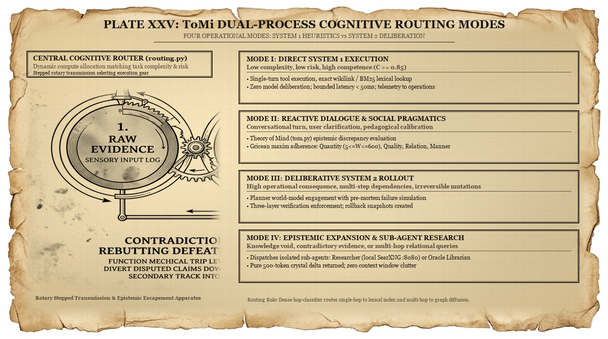
</p>

<p align="center">
  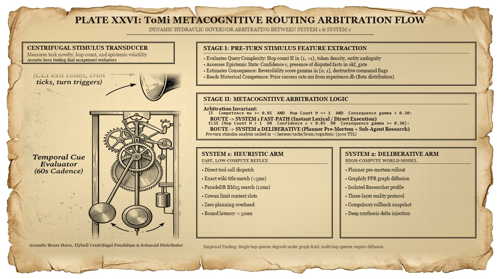
</p>

Routing is not cosmetic, and the two arms need different retrieval strategies. Published evaluations of graph retrieval are sharply bimodal by question type: plain RAG leads on simple fact retrieval, graph methods lead on multi-hop composition.<sup>[15](REFERENCES.md#ref-15)</sup> <sup>[11](REFERENCES.md#ref-11)</sup> A learned hop classifier on dense embeddings alone — no graph needed — reaches macro-F1 0.86 at separating single-hop from multi-hop questions,<sup>[17](REFERENCES.md#ref-17)</sup> which is enough to route direct lookups to the lexical index and multi-hop questions to graph diffusion. One caveat worth keeping: the same work notes that published verdicts on graph-versus-vector retrieval disagree with each other and are typically tied to a single corpus, embedder and judge,<sup>[17](REFERENCES.md#ref-17)</sup> so treat any single retrieval benchmark as weak evidence, and this repo's own arena measurements as the tiebreaker.

---

## 📈 Experience Index & Adaptive Competence Loop

### Reality Gets the Final Vote

Persistent competence cannot be achieved through subjective prompt tweaks. It requires empirical feedback loops grounded in real-world outcomes:

<p align="center">
  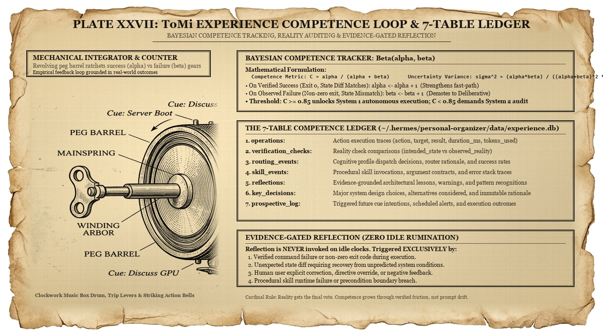
</p>

Verification follows a strict **Three-Layer Reality Protocol**:
1. **Deterministic Assertions**: Exit codes, process status, file existence, and unit test results.
2. **Empirical State Verification**: Diffing actual system state against expected post-conditions.
3. **Auditor Judgment**: Qualitative review invoked only when deterministic tests cannot apply.

<p align="center">
  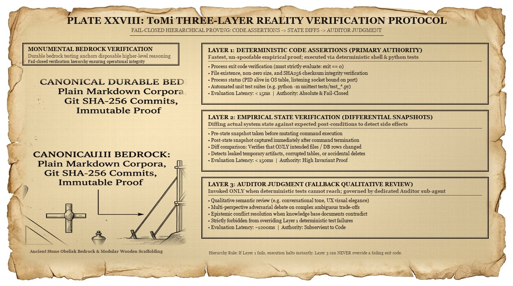
</p>

---

### The 7-Table Competence Ledger (`experience.db`)

ToMi tracks operational history in SQLite across 7 specialized tables:
- **`operations`**: Action-level execution traces (`action`, `target`, `result`, `duration_ms`, `tokens_used`).
- **`verification_checks`**: Intended state vs. observed reality checks.
- **`routing_events`**: Profile dispatch decisions, rationale, and resulting success rate.
- **`skill_events`**: Procedural skill runs, triggers, and failure traces.
- **`reflections`**: Grounded lessons, warnings, and pattern recognitions.
- **`key_decisions`**: Architectural decisions, alternatives considered, and rationale.
- **`prospective_log`**: Triggered future intention executions.

---

### Evidence-Gated Reflection

ToMi never wastes compute on idle daydreaming or aimless rumination. Reflection occurs only when triggered by meaningful empirical events:
- A verified failure or command error.
- A recovery from an unexpected state.
- A human user correction.
- A procedural skill execution failure.

---

### Procedural Learning: Native Skill Evolution

The output of repeated, successful experience is compiled into a governed, reusable **Hermes Skill**:

<p align="center">
  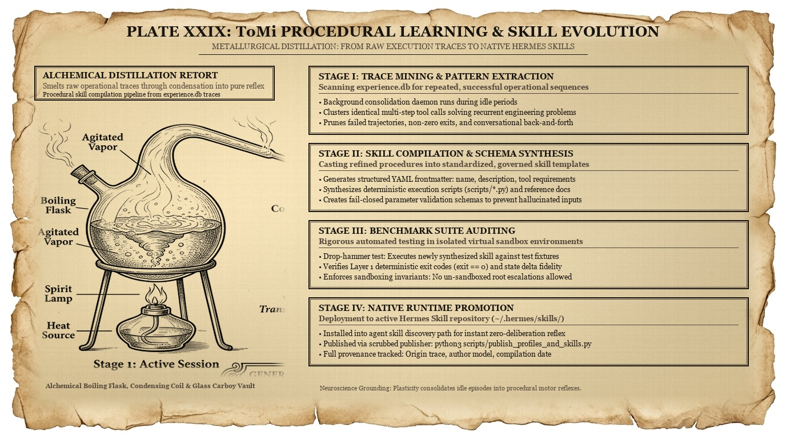
</p>

<p align="center">
  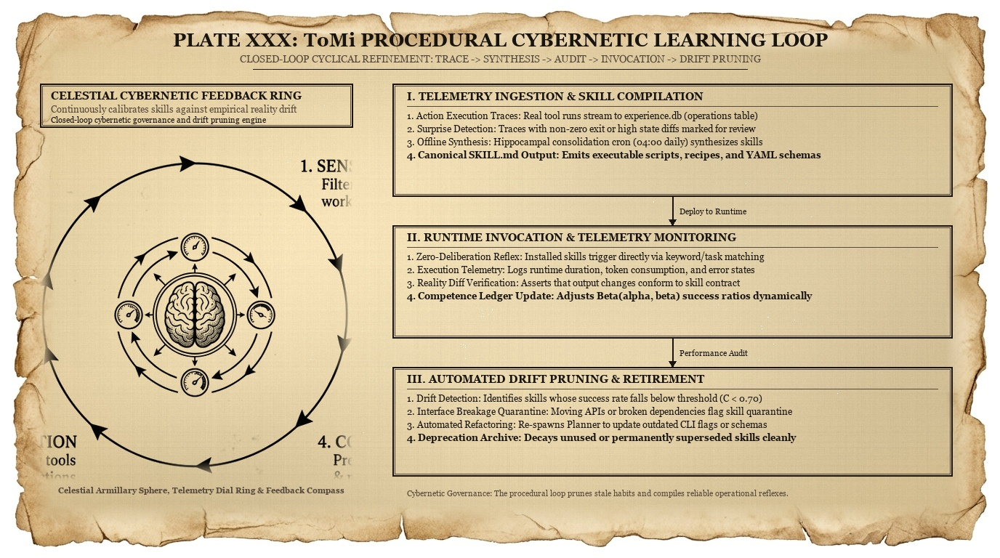
</p>

---

## ⏱️ Autonomous Daemons & Cron Lifecycle

ToMi maintains cognitive health, memory hygiene, and prospective intention monitoring through an autonomous cron scheduler (`cron/jobs.template.json`):

| Schedule | Job Identifier | Target Script / Action | Purpose & Cognitive Function |
| :--- | :--- | :--- | :--- |
| **`0 4 * * *`** (04:00 Daily) | `job-hippocampal-consolidation` | `HermesBrain.run_consolidation_replay()` | **Sharp-Wave Ripple (SWR) Sleep Consolidation**: Replays high-surprise daytime episodes offline to synthesize operational rules, update somatic marker risk weights, and compile procedural skills. |
| **`0 2 * * *`** (02:00 Daily) | `job-decision-synthesis` | `plugins/decision_logger/synthesis.py` | **Decision Synthesis**: Sweeps daytime operational and architecture decisions, clusters them into semantic topics, and links them into the knowledge graph. |
| **`0 * * * *`** (Hourly) | `job-brain-sync` | `scripts/brain_sync_cron.py` | **Knowledge Base Sync**: Incrementally chunks, embeds, and updates the PostgreSQL + pgvector knowledge base from modified Markdown pages. |
| **`*/15 * * * *`** (Every 15m) | `job-reminders-check` | `scripts/check_reminders.py` | **Prospective State Evaluator**: Evaluates cue-based future intentions and active timed alerts in `organizer.db`, dispatching notifications to configured channels. |
| **`*/30 * * * *`** (Every 30m) | `job-experience-capture` | `scripts/capture_experience.py` | **Experience Ingestion**: Parses recent tool execution traces, tokens, and verification results into the SQLite competence ledger (`experience.db` / `state.db`). |
| **`*/30 * * * *`** (Every 30m) | `job-health-check` | `scripts/cortex_health.py` | **System Health Check**: Verifies container health, model endpoint latency, and disk/memory utilization. |
| **`30 2 * * *`** (02:30 Daily) | `job-integrity-check` | `scripts/integrity_check.py` | **Database Integrity Check**: Validates SQLite PRAGMA integrity, pgvector index health, and Markdown frontmatter compliance. |
| **`0 2 * * *`** (02:00 Daily) | `job-database-backup` | `scripts/backup_databases.py` | **Database Snapshots**: Dumps atomic SQLite state files and PostgreSQL pgvector tables into local backup storage. |
| **`0 3 * * *`** (03:00 Daily) | `job-daily-backup` | `scripts/cortex_backup.py` | **Complete State Snapshot**: Compresses configuration, custom skills, hooks, and active wikis into rolling encrypted tar archives. |
| **`0 5 * * *`** (05:00 Daily) | `job-view-generation` | `scripts/generate_views.py` | **View Generation**: Pre-renders dashboard view aggregates and project progress rings for instant Command Deck loading. |
| **`0 5 * * 0`** (Weekly) | `job-session-export` | `scripts/export_sessions.py` | **Session Archive**: Archives old Hermes conversation transcripts to cold storage to keep active SessionDB queries sub-millisecond. |

---

## 🔬 Neuro-Cognitive Python Core (`brain/`)

ToMi encapsulates biologically grounded cognitive modules directly in Python under `brain/`:

```
brain/
├── __init__.py                # Unified HermesBrain facade
├── decisions.py               # Architectural & operational decision capture
├── thalamus/                  # Sensory buffering & Shannon entropy saliency gate
│   ├── buffer.py              # Ring buffer for raw sensory percepts
│   ├── attention.py           # Top-down attentional gating (ThalamicGate) + bottom-up novelty scoring
│   └── adaptive_threshold.py  # Learned, adaptive saliency threshold tracking surprise history
├── cortex/                    # Prefrontal cortex & executive control
│   ├── dl_pfc.py              # Cowan/Miller 4±1 working memory chunk slots & decay
│   ├── router.py              # Kahneman System 1 / System 2 dynamic allocator
│   ├── executive.py           # Miyake triad: inhibition, updating, set-shifting
│   ├── confidence.py          # Grounded confidence scoring across epistemic layers
│   ├── observation_log.py     # Execution outcome tracking & observation traces
│   └── wiring.py              # Inter-subsystem signal wiring
├── limbic/                    # Affective evaluation & visceral risk
│   ├── valence.py             # Epistemic valence, arousal, curiosity, allostatic load
│   ├── somatic.py             # Antonio Damasio Somatic Marker Hypothesis visceral biasing
│   └── amygdala.py            # Fear conditioning, cortical appraisal & extinction inhibition
├── basal_ganglia/             # Action selection & skill compilation
│   ├── action_gate.py         # Striatal Direct (Go), Indirect (No-Go), Hyperdirect brake
│   └── compiler.py            # ACT-R procedural skill compilation from episodic traces
├── hippocampus/               # Associative memory & offline consolidation
│   ├── associative.py         # Personalized PageRank (PPR) associative concept graph
│   ├── pattern_separation.py  # Geometric orthonormal projection & sparsity threshold
│   └── replay.py              # Sharp-Wave Ripple (SWR) prioritized offline replay
├── prospective/               # Prospective memory & standing intentions
│   └── intentions.py          # Gollwitzer implementation intentions (IF cue THEN action)
├── dmn/                       # Default Mode Network simulation
│   ├── chronesthesia.py       # Endel Tulving mental time travel (retrospection/prospection)
│   └── counterfactual.py      # Judea Pearl causal counterfactual regret rollouts
├── epistemology/              # Defeasible logic & belief revision
│   ├── defeater_graph.py      # John Pollock defeater network (rebutting vs undercutting)
│   ├── agm.py                 # AGM belief revision via Levi Identity (minimal mutilation)
│   └── dialectic.py           # Hegelian Thesis-Antithesis-Synthesis reconciler
└── social/                    # Social cognition & pragmatics
    ├── tom.py                 # Recursive Theory of Mind & discrepancy detection
    └── pragmatics.py          # Gricean maxims & conversational implicature decoding
```

### Python API Usage

```python
from brain import HermesBrain

# 1. Initialize the neuro-cognitive architecture
brain = HermesBrain(db_path="brain/brain.db")

# 2. Process an incoming stimulus through all cognitive layers
percept = brain.process_incoming_stimulus(
    source="user_chat",
    text="Can you optimize the PostgreSQL embeddings table and deploy the new index?",
)

print(f"Cognitive Route: {percept['cognitive_route']['mode']}")       # SYSTEM_2_DELIBERATIVE
print(f"Action Gate:    {percept['action_gate']['decision']}")        # GO / NO_GO / EMERGENCY_BRAKE
print(f"Somatic Risk:   {percept['somatic_marker']['risk_score']}")   # 0.12 (Low visceral risk)
print(f"Working Memory: {percept['working_memory_summary']}")

# 3. Post-execution feedback loop
brain.record_action_outcome(
    action="optimize_table",
    target="embeddings",
    success=True,
    surprise_score=0.05,
    steps=["EXPLAIN ANALYZE", "CREATE INDEX idx_hnsw", "VACUUM ANALYZE"],
)
```

---

## 🖥️ Command Deck Dashboard & Spatial Interfaces

<p align="center">
  
</p>

### Executive Operations HUD

The **Command Deck** is a lightweight, responsive web dashboard on **Port 8088**, published on `0.0.0.0` for accessible LAN operation (`http://<host-lan-ip>:8088` or `http://127.0.0.1:8088` locally).

<p align="center">
  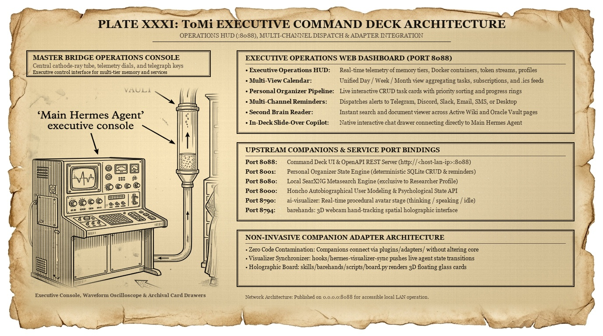
</p>

- **Executive Operations HUD**: Real-time status of all cognitive memory tiers, Docker containers, inference tokens, and active profiles.
- **Multi-View Calendar (Day / Week / Month)**: Aggregates personal tasks, subscription renewals (`organizer.db`), and Google Calendar / `.ics` feeds.
- **Personal Organizer Pipeline**: Live interactive CRUD task cards with priority sorting and active project progress rings.
- **Multi-Channel Reminders**: Create, snooze, and dismiss alerts dispatched to Telegram, Discord, Slack, Email, SMS, or Desktop.
- **Second Brain Reader**: Instant search and formatted document preview across Active Wiki and Oracle Vault markdown pages.
- **In-Deck Slide-Over Copilot**: Native chat drawer connecting directly to Hermes Agent.

---

### Upstream Companion Applications (`ai-visualizer` & `barehands`)

ToMi integrates Jared Rhodes' open-source visualizer and spatial hand-tracking projects via **non-invasive adapters**:

1. **[ai-visualizer](https://github.com/jaredrhod/ai-visualizer) (Port 8790)**:
   - Real-time procedural animated faces (Neural Core, Radial Starburst, Matrix Rain, Circuit Board).
   - Responds dynamically to agent states: `thinking`, `speaking`, and `idle`.
   - Driven non-invasively via `hooks/hermes-visualizer-sync/` and `plugins/adapters/visualizer.py`.
2. **[barehands](https://github.com/jaredrhod/barehands) (Port 8794)**:
   - 3D webcam hand-tracking spatial interface.
   - Enables Hermes Agent to present holographic glass cards, system architecture maps, and mind maps in mid-air.
   - Controlled via CLI tools (`skills/barehands/scripts/board.py`) and `plugins/adapters/barehands.py`.

---

### Service Port Matrix

| Service | Port | Endpoint | Description |
| :--- | :--- | :--- | :--- |
| **Command Deck UI** | `8088` | `http://<host-lan-ip>:8088` | Executive Web Dashboard & Copilot Chat |
| **Command Deck API** | `8088` | `http://<host-lan-ip>:8088/docs` | Interactive OpenAPI REST Endpoints |
| **Personal Organizer** | `8001` | `http://127.0.0.1:8001/docs` | Deterministic State & Task REST API |
| **SearXNG** | `8080` | `http://127.0.0.1:8080` | Local Metasearch Engine (Researcher Profile) |
| **Honcho Memory** | `8000` | `http://127.0.0.1:8000` | Autobiographical User Model API |
| **AI Visualizer** | `8790` | `http://127.0.0.1:8790` | Procedural Reactive Avatar Stage |
| **Barehands 3D** | `8794` | `http://127.0.0.1:8794` | Hand-Tracking 3D Spatial Holographic Board |

---

### Self-Hosted VM Deployment Topology

ToMi supports containerized deployment across isolated virtual machines and local container runtimes:

<p align="center">
  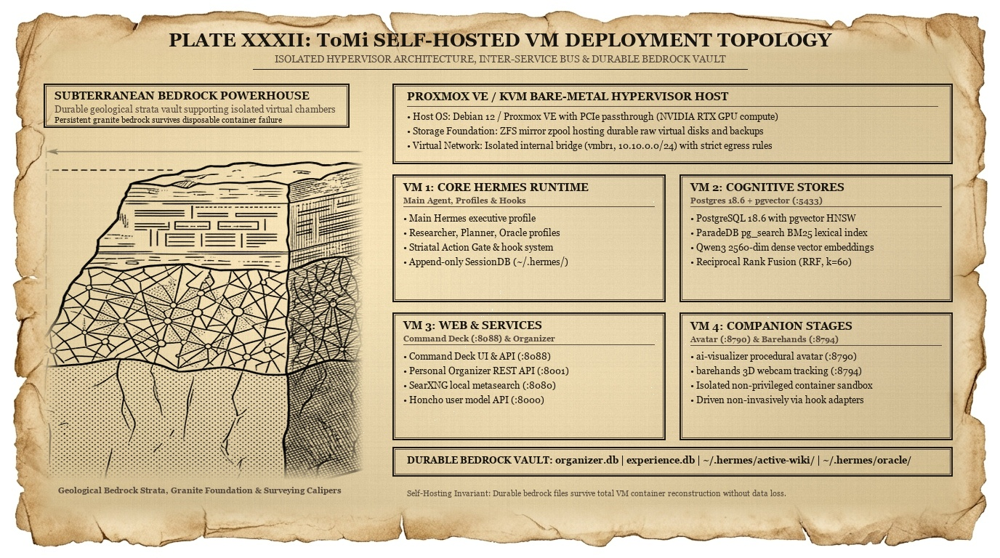
</p>

---

## 🎯 Canonical Division of Authority (Sources of Truth)

| Information | Authority / Store | Mechanism |
| :--- | :--- | :--- |
| **User Model & Psychological Inferences** | Honcho (`http://127.0.0.1:8000`) | Autobiographical dialectic sessions |
| **Human Tasks, Deadlines & Subscriptions** | Personal Organizer (`organizer.db -> tasks`) | Deterministic SQLite CRUD |
| **Timed Multi-Channel Reminders** | Personal Organizer (`organizer.db -> reminders`) | SQLite cron poll & multi-channel dispatch |
| **Future Cue-Based Intentions** | Personal Organizer (`organizer.db -> intentions`) | Prospective trigger evaluator |
| **Current Working Semantic Knowledge** | Active LLM-Wiki (`~/.hermes/active-wiki/`) | Curated Markdown pages |
| **Historical Synthesized Knowledge** | Oracle Brain (`~/.hermes/oracle/brain/`) | Decanted Markdown synthesis |
| **Raw Historical & Research Evidence** | Oracle Raw (`~/.hermes/oracle/raw/`) | Preserved raw files & research logs |
| **Long-Term Retrieval & Vector Search** | Brain Search (Postgres + pgvector) | Hybrid BM25 + dense cosine RRF index |
| **Exact Conversation & Tool Transcripts** | Hermes SessionDB (`~/.hermes/session.db`) | Append-only execution history |
| **Operational Outcome Traces & Reflections** | Competence Ledger (`experience.db` / `state.db`) | 7-table competence ledger |
| **Defeasible Claims & Epistemic Status** | Defeater Graph & Brain Search metadata | Pollock network & provenance tags |
| **Reusable Procedural Workflows** | Hermes Skills (`~/.hermes/skills/`) | Governed procedural skill files |
| **External Internet Research** | Researcher Profile via SearXNG | Isolated browser & search tools |
| **Complex Planning & Consequence Rollouts** | Planner Profile | World-model contract & pre-mortem |
| **Ambiguous Evaluation & Verification** | Auditor Profile & Verifier | Three-layer reality protocol |

---

## 🚫 Architectural Principles & Boundaries (What We Do NOT Build)

Long before modern LLMs, cognitive architectures like **ACT-R** and **SOAR** established that different cognitive states require distinct semantics. ToMi adopts these foundational insights without unnecessary bloat:

- **No Custom Skill Foundry**: Hermes already has procedural skills. ToMi compiles directly into native skill files.
- **No Second Transcript Store**: Hermes SessionDB is authoritative. We record only operational outcomes and reflections in `experience.db`.
- **No Second Multi-Agent Framework**: Hermes Profiles, delegation, and Kanban are used directly.
- **No Separate Schedulers**: Intentions map to Hermes cron and webhooks.
- **No Emotion Simulator or "Amygdala Agent"**: Epistemic valence, somatic risk penalties, and allostatic load metadata are sufficient. Computational fear conditioning and prefrontal extinction pathways are implemented directly in code (`brain/limbic/amygdala.py`) without constructing an ungrounded emotion agent.
- **No Autonomous Overnight Dreamer**: No LLM wanders through private files unprompted. Reflection is strictly evidence-gated.
- **No Automatic Forgetting**: Memory temperature solves scaling without destructive data deletion.

---

## 🚀 Quickstart & Installation

ToMi is designed to be installed either autonomously by Hermes Agent or manually via single-command setup scripts.

### 🤖 Autonomous Setup for Hermes Agent

Point your Hermes Agent at this repository and instruct it to install:

```text
Set up ToMi from https://github.com/TheHappyHermit/ToMi-Theory-of-Mind.git
```

Hermes Agent will read [`AGENT.md`](AGENT.md) and execute the automated setup script (`python install.py --auto`), configuring all profiles, skills, hooks, plugins, cron schedules, and containers automatically.

> **Note on Setup Scope**: `install.py --auto` (or `.\setup.ps1 --auto` on Windows, `./setup.sh --auto` on Linux/macOS) provisions the core cognitive architecture into `~/.hermes/`, 15 profiles, 5 lifecycle hooks, skills, and starts the ParadeDB and dashboard stacks. For full-scale companion applications and ecosystem components, see [`docs/FULL-COMPONENT-INSTALL.md`](docs/FULL-COMPONENT-INSTALL.md).

### 🧑‍💻 Manual Installation

For complete step-by-step installation instructions, environment setup, and verification tests across Linux, macOS, and Windows, refer to:

- 📖 **[Comprehensive Installation Guide (`INSTALL.md`)](INSTALL.md)**
- ⚙️ **[Configuration & Environment Guide (`SETUP.md`)](SETUP.md)**
- 🤖 **[Agent Autonomous Setup Instructions (`AGENT.md`)](AGENT.md)**

---

## 📚 Documentation Directory & Upstream Credits

### Documentation Directory

| Document | Purpose |
| :--- | :--- |
| [AGENT.md](AGENT.md) | Autonomous setup playbook and operating instructions for Hermes Agent |
| [INSTALL.md](INSTALL.md) | Comprehensive installation and environment setup |
| [SETUP.md](SETUP.md) | Configuration guide, environment variables, and schema |
| [PROPOSED-BRAIN-ARCHITECTURE.md](PROPOSED-BRAIN-ARCHITECTURE.md) | Comprehensive 7-category evidence dossier, neuroanatomical map & research synthesis |
| [docs/COMPANION_APPS.md](docs/COMPANION_APPS.md) | AI Visualizer and Barehands 3D setup and adapters |
| [docs/FULL-COMPONENT-INSTALL.md](docs/FULL-COMPONENT-INSTALL.md) | Full installable component set specifications for fresh Hermes setups |
| [docs/REFERENCE.md](docs/REFERENCE.md) | Deep architectural reference and security model |
| [SYSTEM-RULES.md](SYSTEM-RULES.md) | Behavioral rules governing all Hermes profiles |
| [SOUL.md](SOUL.md) | Personality, cognitive philosophy, and tone contract |
| [docs/SCHEMAS.md](docs/SCHEMAS.md) | Database schemas (`experience.db`, `organizer.db`, Postgres) |
| [docs/ATTRIBUTION.md](docs/ATTRIBUTION.md) | External projects, libraries, and skill credits |
| [REFERENCES.md](REFERENCES.md) | **Every paper cited in this README, with verified titles, DOIs/arXiv IDs, and a quarantined list of citations that were checked and refuted** |
| [RETRIEVAL-SETUP-HANDOFF.md](RETRIEVAL-SETUP-HANDOFF.md) | Handoff: BM25/pg_search migration, graph-seeding fix, supersedence filter, and the open-decision register |
| [DB-MIGRATION-HANDOFF.md](DB-MIGRATION-HANDOFF.md) | Handoff: adopt the database into this repo, upgrade to PostgreSQL 18, repoint every consumer, scrub the legacy brand |
| [`cognition-arena/ARENA.md`](cognition-arena/ARENA.md) | **Corpus distillation, complete.** The best three ranked ideas per cognitive area, and why they beat each other — 150 areas over 91 tranches. See [Cognition Arena](#-cognition-arena-the-completed-corpus-walk) below. |
| [TROUBLESHOOTING.md](TROUBLESHOOTING.md) | Diagnostic steps and common solutions |

---

## 🧪 Cognition Arena: The Completed Corpus Walk

Between 2026-09-24 and 2026-09-27 an autonomous job walked the entire knowledge corpus, read every file in full, and ranked the best ideas per cognitive area against the project's own architecture. **It finished with the corpus exhausted.**

| | |
|---|---|
| Files read | **1,793** of 2,217 |
| Excluded (out of scope) | 422 |
| Blocked | 2 |
| **Remaining** | **0 — the corpus is exhausted** |
| Areas opened | **150** |
| Tranches | 91 |
| `ARENA.md` | 24,232 lines |
| `ARENA-EVIDENCE.md` | 24,720 lines (append-only, never pruned) |

The output is a **ranked answer file** — for each cognitive area, the best three ideas and the evidence separating them — not a reading list. Its method is adversarial by construction: a new area must be probed against all existing areas and earn its place, and the file records where it *declined* to open an area, not only where it succeeded. The final tranche opened two areas, both about instruments rather than mechanisms, and recorded one conflict as UNRECONCILED with a reopening trigger rather than resolving it silently.

**Two things this project will not repeat**, both learned here:

- **A check that cannot fail is not a check.** The read-compliance audit reported NON-COMPLIANT and instructed the operator to reset 1,793 marks, because it read only the live log while ignoring three rotated siblings. With rotation handled the true ratio is 1.41 reads per mark. Its bulk-read threshold had also been set equal to the `read_file` tool's own 100,000-character cap, so every legitimate read of a large file looked like a bulk window. Both are fixed, and `tests/test_verify_reads_regression.py` now proves the failure path still fires — because a relaxed check that can no longer fail is worth nothing.
- **A subsystem you cannot detect working is not thereby dead.** A controlled ablation of a comparable 15-subsystem architecture found **14 of 15** subsystems appeared to contribute nothing at moderate load; at higher load **9 of 15** became individually critical, five moving from exactly 0% to below −89%. The authors call this *cooperative masking*.<sup>[31](REFERENCES.md#ref-31)</sup> Ablate at the operating point, or you will conclude that everything is decorative.

The arena's own numbers are the tiebreaker for this repo's retrieval design — see [Derived Knowledge Graph & Multi-Hop Traversal](#derived-knowledge-graph--multi-hop-traversal). Where a published benchmark and a local measurement disagree, the local measurement wins, because it was run on this corpus.

---

## 📖 References & Evidence Base

Every numbered superscript in this document links to a full citation in **[`REFERENCES.md`](REFERENCES.md)** — click any `<sup>[N](#ref-N)</sup>` to jump to the source, or open `REFERENCES.md` to read the abstract-level summary, the exact claim each number supports, and the caveat that qualifies it.

**The citation standard used here is deliberately strict, because this repo has already been burned by it.** A citation qualifies only after its *title* has been read at source — not inferred from the arXiv API (which returns HTTP 200 with an empty title for IDs that do not exist) and not inferred from a retrieval tool. The standing failure mode in this project was an ID transposition, `2504.13171` → `2404.13171`, which presented a **solar-physics paper on anemone jets** as a memory-systems result. The underlying idea was sound; the citation was simply wrong. `REFERENCES.md` therefore carries a **Cited-but-quarantined** section listing claims that were checked and refuted, so they are never reintroduced.

A few things this README deliberately does *not* claim:

- **The graph is not claimed to be necessary.** One system reached 93.0% on a standard long-horizon benchmark with no graph store at all.<sup>[24](REFERENCES.md#ref-24)</sup> The graph is claimed only to be *useful where multi-hop composition or supersession resolution is required*.<sup>[15](REFERENCES.md#ref-15)</sup> <sup>[20](REFERENCES.md#ref-20)</sup>
- **BM25 lexical scoring is live via ParadeDB `pg_search`.** (Migrated from PostgreSQL `ts_rank()`; see [Rebuildable Search Infrastructure](#rebuildable-search-infrastructure-dense--hybrid-search)).
- **Offline consolidation is not claimed to require sleep.** The mechanism is better described as *idle* precomputation.<sup>[4](REFERENCES.md#ref-4)</sup> <sup>[5](REFERENCES.md#ref-5)</sup> <sup>[6](REFERENCES.md#ref-6)</sup>
- **No component-scaffold claim rests on a single benchmark.** Published graph-versus-vector retrieval verdicts disagree with one another and are usually tied to one corpus, embedder and judge.<sup>[17](REFERENCES.md#ref-17)</sup> This repo's own `cognition-arena/` measurements are the tiebreaker.

---

### Upstream Projects & Research

- **[Hermes Agent](https://github.com/NousResearch/hermes-agent)** by Nous Research
- **[Honcho](https://github.com/plastic-labs/honcho)** by Plastic Labs
- **[ai-visualizer](https://github.com/jaredrhod/ai-visualizer)** by Jared Rhodes
- **[barehands](https://github.com/jaredrhod/barehands)** by Jared Rhodes
- **[LLM-Wiki Pattern](https://gist.github.com/karpathy/442a6bf555914893e9891c11519de94f)** by Andrej Karpathy
- **[Graphify](https://github.com/safishamsi/graphify)** by Safi Shamsi / Graphify-Labs
- **[SearXNG](https://github.com/searxng/searxng)** Metasearch Engine
- **[Firecrawl](https://github.com/mendableai/firecrawl)** Web Scraping Engine
- **[PostgreSQL](https://www.postgresql.org/) & [pgvector](https://github.com/pgvector/pgvector)**

---

<p align="center">
  <b>ToMi: Theory of Mind</b> — <i>Sovereign Cognitive Architecture for Long-Horizon Autonomous Intelligence.</i>
</p>